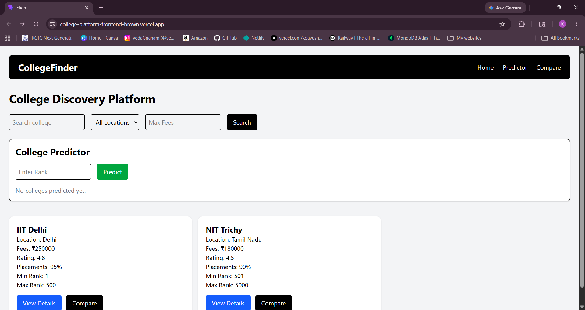
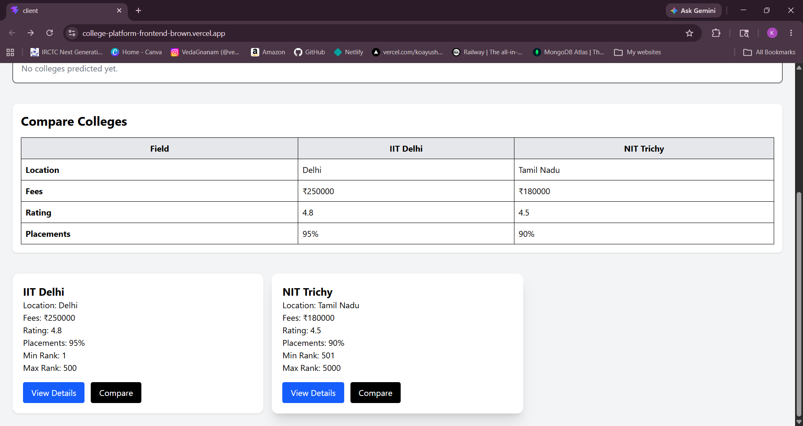
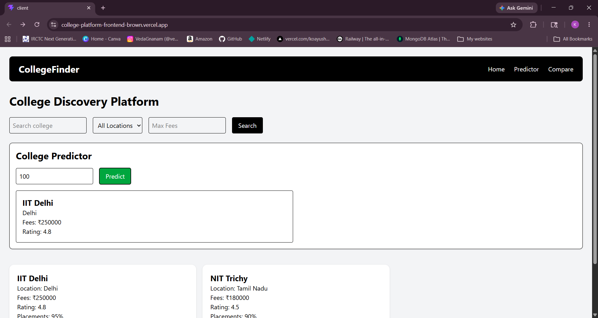
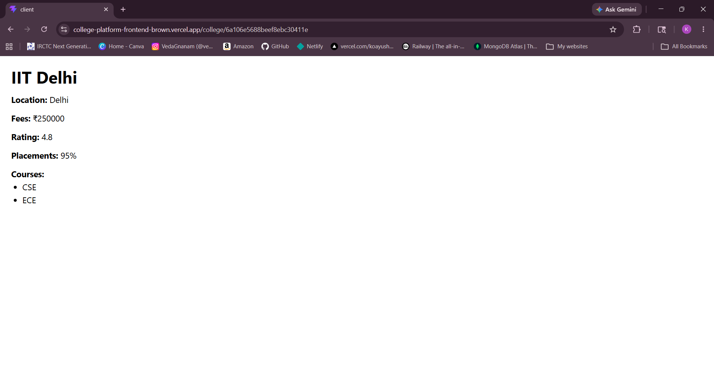

# 🎓 College Discovery Platform - Frontend

Frontend of the College Discovery Platform built using React, Vite, and Tailwind CSS.

---

# 🚀 Live Demo

https://college-platform-frontend-brown.vercel.app

---

# ✨ Features

- 🔍 Search colleges
- 📍 Filter colleges by location
- 💰 Filter colleges by fees
- ⚖️ Compare colleges
- 🎯 College predictor tool
- 📄 College details page
- 📱 Responsive UI

---

# 🛠️ Technologies Used

- React.js
- Vite
- Tailwind CSS
- React Router DOM
- Axios

---

# 📂 Folder Structure

```bash
src/
├── components/
├── pages/
├── App.jsx
├── main.jsx
└── config.js
```

---

# ⚙️ Installation

## Clone Repository

```bash
git clone https://github.com/koayush1310/college-platform-frontend
```

## Navigate to Project

```bash
cd college-discovery-frontend
```

## Install Dependencies

```bash
npm install
```

## Configure Backend URL

Create:

```bash
src/config.js
```

Add:

```js
export const API_URL =
  "http://localhost:5000";
```

---

# ▶️ Run Frontend

```bash
npm run dev
```

---

# 🌍 Backend API

Backend Repository:

https://github.com/koayush1310/college-platform-frontend

---

# 📸 Screenshots

## Home Page


## Compare Colleges


## Predictor Tool


## College Details Page


---

# 🔥 Future Improvements

- Authentication
- Dark mode
- Pagination
- Saved colleges
- AI recommendations

---

# 👨‍💻 Author

Ayush